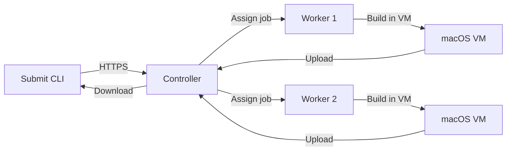

# Expo Free Agent

**Build Expo apps on your own hardware.** A distributed build system that runs on Mac computers you control.

```
┌──────────────┐      ┌──────────────┐      ┌──────────────┐
│   Your CLI   │ ───> │  Controller  │ ───> │   Workers    │
│              │      │ (Coordinates)│      │  (Build VMs) │
└──────────────┘      └──────────────┘      └──────────────┘
   Submit build       Queue & assign       Execute in isolation
```

## What Is This?

Expo Free Agent is a self-hosted alternative to cloud build services. Instead of paying per-build or per-minute:

- **Run builds on your Macs** - Use spare compute capacity
- **Full control** - Your code never leaves your infrastructure
- **Zero usage fees** - Pay only for hardware you already own
- **VM isolation** - Every build runs in a fresh, isolated virtual machine

**Perfect for:**
- Teams with spare Mac hardware
- Projects requiring on-premise builds
- High build volume (cost savings vs cloud)
- Air-gapped or regulated environments

---

## Quick Links

| I want to... | Go here |
|--------------|---------|
| **Try it in 5 minutes** | [5-Minute Start](./docs/getting-started/5-minute-start.md) |
| **Deploy to production** | [Setup Remote](./docs/getting-started/setup-remote.md) |
| **Understand the architecture** | [Architecture Diagrams](./docs/architecture/diagrams.md) |
| **Learn about security** | [Security Model](./docs/architecture/security.md) |
| **Contribute code** | [Contributing Guide](./CLAUDE.md) |
| **Browse all docs** | [Documentation Index](./docs/INDEX.md) |

---

## Get Started in 5 Minutes

### 1. Verify Prerequisites

```bash
./scripts/verify-setup.sh
```

**Requirements:** macOS, Bun installed ([install Bun](https://bun.sh))

### 2. Start Controller

```bash
git clone https://github.com/expo/expo-free-agent.git
cd expo-free-agent
bun install
bun controller
```

Copy the API key from the output.

### 3. Start Worker

```bash
npx @sethwebster/expo-free-agent-worker
open /Applications/FreeAgent.app
```

Connect the worker to `http://localhost:3000` with your API key.

### 4. Submit a Build

```bash
cd ~/my-expo-app
npx expo-build submit --platform ios
```

**Done!** Your build is running. ☕ Coffee time (~10 minutes).

[**Full 5-Minute Guide →**](./docs/getting-started/5-minute-start.md)

---

## Architecture



**Three components:**

1. **Controller** (Node.js/Bun) - Central server that coordinates builds
   - SQLite database for state
   - File storage for source/artifacts
   - Job queue with worker assignment
   - Web UI for monitoring

2. **Worker** (macOS/Swift) - Runs on your Macs
   - Menu bar app
   - Creates isolated VMs for builds
   - Downloads source, executes build, uploads results
   - Automatic cleanup after each build

3. **Submit CLI** (Node.js) - Command-line tool
   - Bundles your project
   - Submits to controller
   - Downloads completed builds

[**See Architecture Diagrams →**](./docs/architecture/diagrams.md)

---

## Features

### ✅ Implemented

- **VM Isolation** - Builds run in ephemeral macOS VMs (Apple Virtualization Framework)
- **Secure** - Code signing, notarization, API key auth, path traversal protection
- **Web UI** - Monitor builds and workers in real-time
- **Worker Installer** - One command to install worker app
- **CLI** - Submit builds, check status, download artifacts
- **Testing** - Comprehensive test suite (unit, integration, e2e)
- **Documentation** - Full docs with diagrams and guides

### 🚧 Roadmap

- **Multi-user support** - Isolated builds per user
- **Build secrets** - Encrypted environment variables
- **Worker pools** - Assign specific workers to projects
- **Artifact encryption** - Encrypt stored builds
- **Metrics** - Build time analytics, worker utilization

---

## Security

Every build runs in an isolated VM with:
- ❌ **No network access** (outbound blocked)
- ❌ **No host filesystem access** (VM cannot see host)
- ✅ **Ephemeral environment** (destroyed after build)
- ✅ **Resource limits** (CPU, memory, disk, time)
- ✅ **Code signing** (Worker app is Apple-notarized)

**Read more:** [Security Architecture](./docs/architecture/security.md)

---

## Project Structure

```
expo-free-agent/
├── packages/
│   ├── controller/        # Central server (Express + SQLite + Web UI)
│   ├── worker-installer/  # Worker installation CLI
│   └── landing-page/      # Marketing site (Vite + React + Tailwind)
├── cli/                   # Build submission CLI
├── free-agent/           # macOS worker app (Swift)
├── docs/                 # Documentation
│   ├── getting-started/  # Quickstart, setup guides
│   ├── architecture/     # System design, diagrams
│   ├── operations/       # Deployment, release procedures
│   └── testing/          # Test strategies
├── scripts/              # Utility scripts
└── test/                 # Test fixtures and utilities
```

---

## Usage

### Controller

```bash
# Start controller (development)
bun controller

# Start with auto-reload
bun controller:dev

# Custom port
bun controller -- --port 8080

# Health check
curl http://localhost:3000/health
```

### Worker

```bash
# Install worker app
npx @sethwebster/expo-free-agent-worker

# Launch (menu bar app)
open /Applications/FreeAgent.app
```

### CLI

```bash
# Submit build
expo-build submit --platform ios

# Check status
expo-build status build-abc123

# Download artifacts
expo-build download build-abc123

# List all builds
expo-build list
```

---

## Testing

```bash
# Quick smoketest (30 seconds)
./smoketest.sh

# Full end-to-end test (5 minutes)
./test-e2e.sh

# Run all test suites
bun run test:all

# Specific suites
bun run test:controller
bun run test:cli
bun run test:versions
```

[**Testing Documentation →**](./docs/testing/testing.md)

---

## Documentation

All documentation is in the [`docs/`](./docs/) directory:

- [**Documentation Index**](./docs/INDEX.md) - Start here for navigation
- [Getting Started](./docs/getting-started/) - Quickstart, setup guides
- [Architecture](./docs/architecture/) - System design, security, diagrams
- [Operations](./docs/operations/) - Deployment, release, troubleshooting
- [Testing](./docs/testing/) - Test strategies and procedures

---

## Technical Stack

| Component | Technology |
|-----------|------------|
| **Runtime** | Bun |
| **Server** | Express.js |
| **Database** | SQLite (bun:sqlite) |
| **Storage** | Local filesystem |
| **Queue** | In-memory (EventEmitter) |
| **Worker** | Swift (macOS) |
| **Virtualization** | Apple Virtualization Framework |
| **UI** | EJS templates |
| **Landing Page** | Vite + React 19 + Tailwind CSS v4 |

---

## Storage Layout

```
data/
└── controller.db         # SQLite database (builds, workers, jobs)

storage/
├── builds/{buildId}/
│   ├── source/          # Source code tarballs
│   └── artifacts/       # Built .ipa/.apk files
└── certs/               # Signing certificates (future)
```

---

## Contributing

We welcome contributions! This project follows strict guidelines to maintain quality:

1. **Read first:** [CLAUDE.md](./CLAUDE.md) - Mandatory agent rules and guardrails
2. **Setup:** [Local Development Guide](./docs/getting-started/setup-local.md)
3. **Test:** All PRs must include tests and pass `bun run test:all`
4. **Docs:** Update documentation for any user-facing changes

**Key principles:**
- Less code is better than more code
- Production-quality from day 1
- Security by design (no regressions on Gatekeeper/notarization)
- Version synchronization enforced by pre-commit hook

---

## License

MIT

---

## Questions?

- **Documentation:** [docs/INDEX.md](./docs/INDEX.md)
- **Issues:** [GitHub Issues](https://github.com/expo/expo-free-agent/issues)
- **Discussions:** [GitHub Discussions](https://github.com/expo/expo-free-agent/discussions)

---

## Feedback

**Was this documentation helpful?**

👍 Yes • 👎 No

Help us improve:
- [Report an issue](https://github.com/expo/expo-free-agent/issues/new?labels=documentation)
- [Suggest improvements](https://github.com/expo/expo-free-agent/discussions)
- [Edit this page](https://github.com/expo/expo-free-agent/edit/main/README.md)

---

**Made with ☕️ by engineers who wanted control over their build infrastructure.**
