# Expo Free Agent - Architecture Diagrams

Visual representations of the system architecture, data flows, and component interactions.

## System Overview

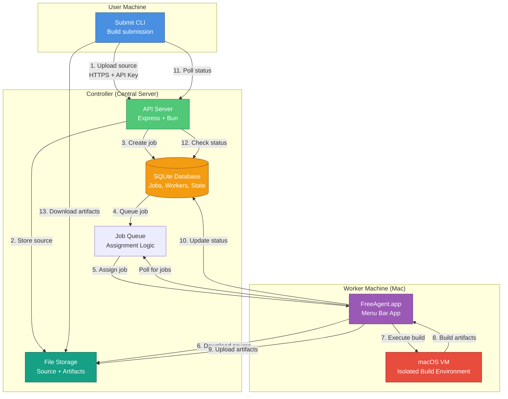

## Build Lifecycle

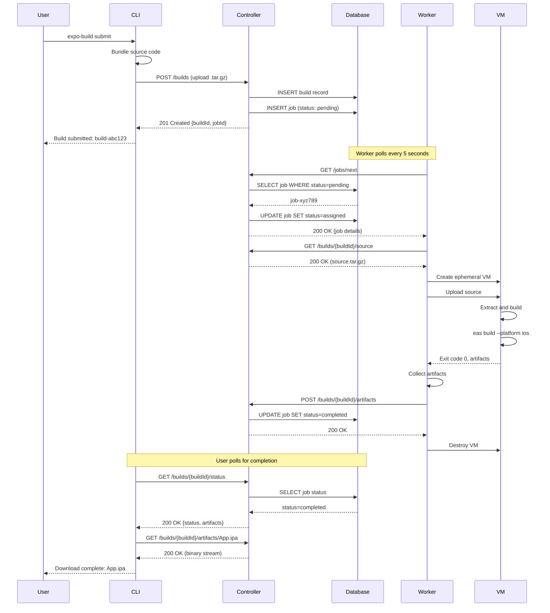

## VM Isolation Model

```mermaid
graph TB
    subgraph "Worker Host (macOS)"
        HostOS[macOS Host OS]
        FreeAgent[FreeAgent.app<br/>Swift Application]
        HyperKit[Apple Virtualization<br/>Framework]

        subgraph "Security Boundaries"
            Firewall[Firewall Rules]
            FileSystem[Host Filesystem]
            Network[Host Network]
        end
    end

    subgraph "Isolated VM"
        GuestOS[macOS Guest OS<br/>Read-only System]
        BuildDir[/tmp/build-{id}<br/>Temporary Workspace]
        BuildProcess[eas build<br/>Untrusted Code]

        NetBlock[Network: BLOCKED<br/>No outbound access]
    end

    FreeAgent -->|Manages| HyperKit
    HyperKit -->|Hardware Isolation| GuestOS

    FreeAgent -.->|Copy source in| BuildDir
    FreeAgent -.->|Copy artifacts out| BuildDir

    BuildProcess -->|Read/Write| BuildDir
    BuildProcess -.->|Blocked| NetBlock
    BuildProcess -.->|Cannot access| FileSystem
    BuildProcess -.->|Cannot access| Network

    GuestOS -->|Ephemeral<br/>Destroyed after build| HyperKit

    style GuestOS fill:#E74C3C,stroke:#922B21,color:#fff
    style BuildProcess fill:#E67E22,stroke:#A04000,color:#fff
    style NetBlock fill:#95A5A6,stroke:#566573,color:#fff
    style HyperKit fill:#3498DB,stroke:#1A5490,color:#fff
    style FreeAgent fill:#9B59B6,stroke:#6C3483,color:#fff

    classDef blocked fill:#E74C3C,stroke:#922B21,stroke-dasharray: 5 5
    class NetBlock,FileSystem,Network blocked
```

## Component Interactions

### Build Submission Flow

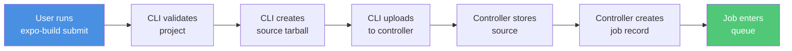

### Job Assignment Flow

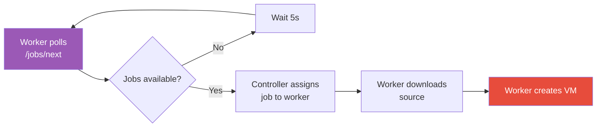

### Build Execution Flow

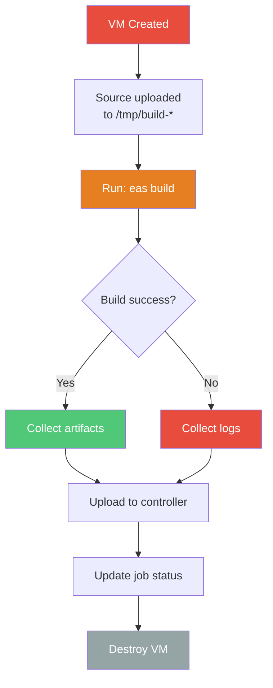

### Artifact Download Flow

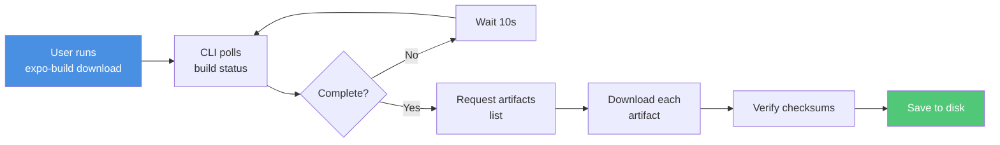

## Data Flow Visualization

### Source Code Journey

```mermaid
graph TB
    A[Local Project<br/>Directory] -->|tar + gzip| B[source.tar.gz<br/>~10-50 MB]
    B -->|HTTPS Upload| C[Controller Storage<br/>data/builds/{buildId}/source/]
    C -->|HTTPS Download| D[Worker<br/>Temporary Storage]
    D -->|VM Copy| E[VM Filesystem<br/>/tmp/build-{id}/]
    E -->|Build Process| F[Compiled Artifacts]
    F -->|VM Copy Out| G[Worker<br/>Temporary Storage]
    G -->|HTTPS Upload| H[Controller Storage<br/>data/builds/{buildId}/artifacts/]
    H -->|HTTPS Download| I[User Machine<br/>./App.ipa]

    style A fill:#4A90E2,color:#fff
    style E fill:#E74C3C,color:#fff
    style I fill:#50C878,color:#fff
```

### State Transitions

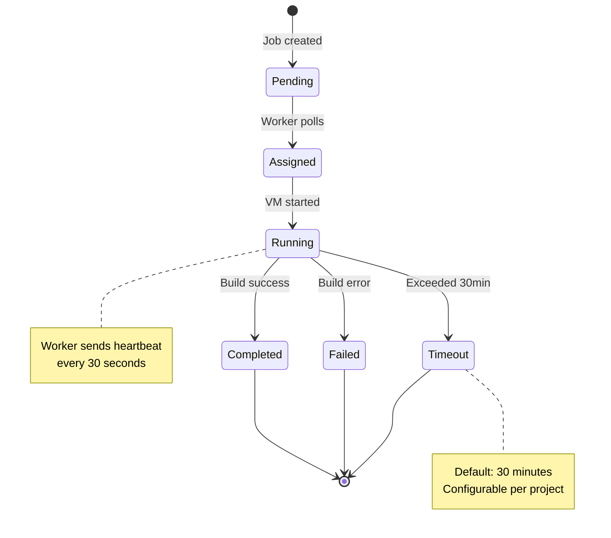

## API Flow Diagrams

### Authentication Flow

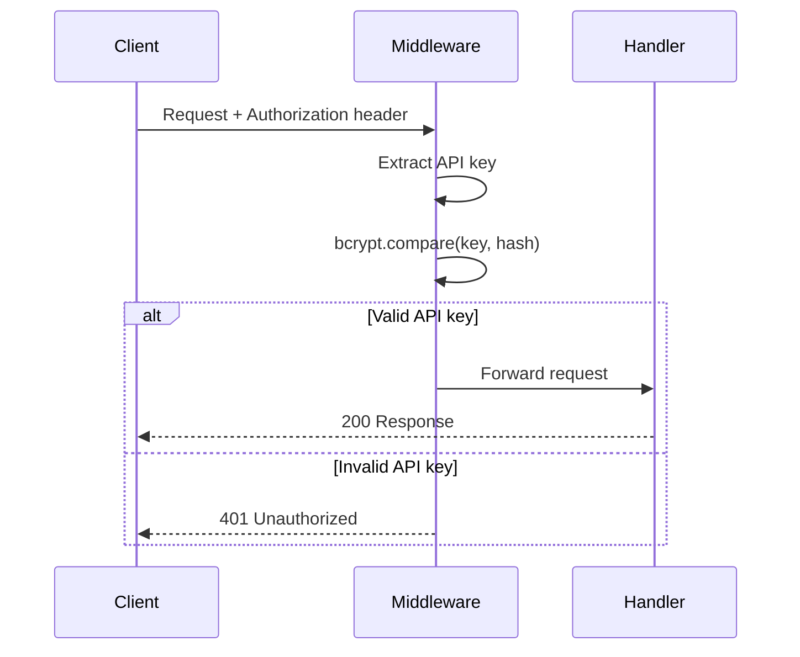

### Upload Flow (Multipart)

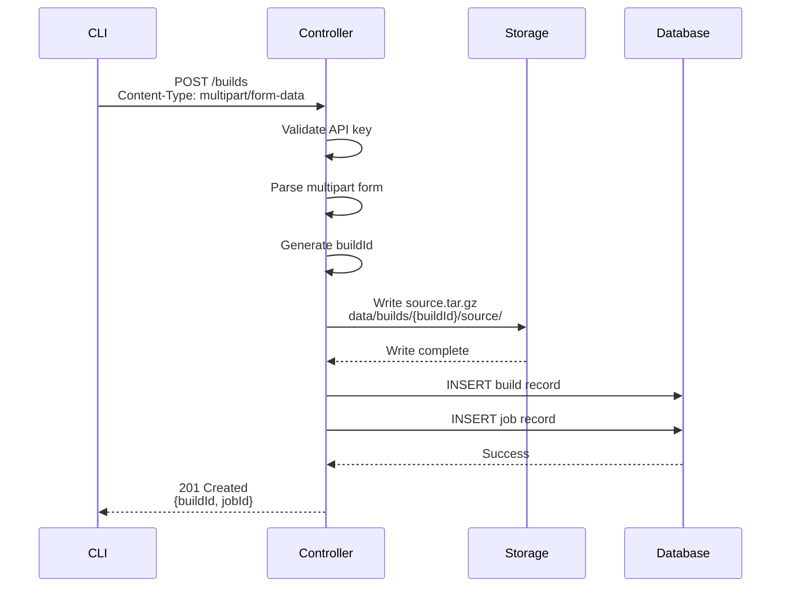

### Download Flow (Streaming)

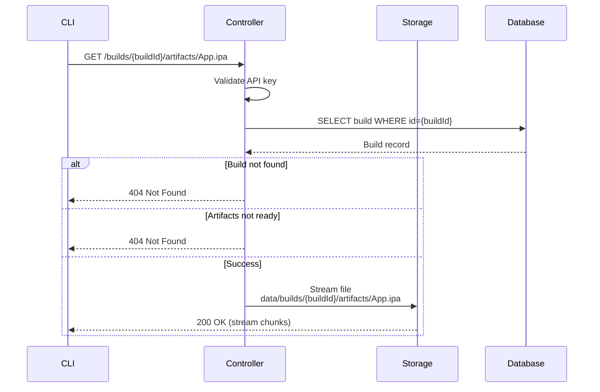

## Information Hierarchy

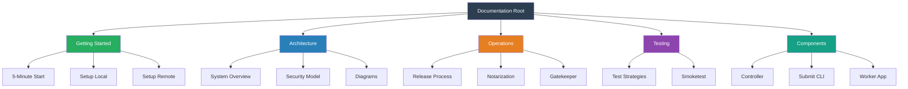

## Visual Style Guide

### Diagram Conventions

**Colors:**
- **User/CLI**: `#4A90E2` (Blue) - User-facing components
- **Controller**: `#50C878` (Green) - Server-side components
- **Worker**: `#9B59B6` (Purple) - Worker machine components
- **VM**: `#E74C3C` (Red) - Isolated build environment
- **Database**: `#F39C12` (Orange) - Persistent storage
- **File Storage**: `#16A085` (Teal) - File system storage
- **Error/Blocked**: `#E74C3C` (Red, dashed) - Security boundaries

**Shapes:**
- **Rectangles**: Services, processes, applications
- **Cylinders**: Databases, storage
- **Diamonds**: Decision points
- **Rounded boxes**: User interactions

**Line Styles:**
- **Solid arrows**: Data flow, API calls
- **Dashed arrows**: Blocked access, cannot access
- **Thick arrows**: Primary flow
- **Thin arrows**: Secondary flow

### Screenshot Standards

**Resolution:**
- Desktop: 2x retina (2880x1800 or similar)
- Scale down to 1440x900 for display
- Always use PNG format for clarity

**Annotations:**
- Use red arrows for "click here"
- Use yellow highlights for important areas
- Use numbered circles for step-by-step guides
- Add 2px border (#E0E0E0) around screenshots

**Context:**
- Always show enough context (full window when possible)
- Crop out personal information
- Use consistent theme (light mode preferred)

### Code Block Standards

**Filename headers:**
```bash
# filename: path/to/file.ts
code here...
```

**Line highlights:**
Use comments `// <--` for important lines

**Expected output:**
Always show output below commands:
```bash
$ expo-build submit
✓ Build submitted successfully
Build ID: build-abc123
```

---

**Navigation:**
- [Back to Architecture](./architecture.md)
- [Security Model](./security.md)
- [Documentation Index](../INDEX.md)
