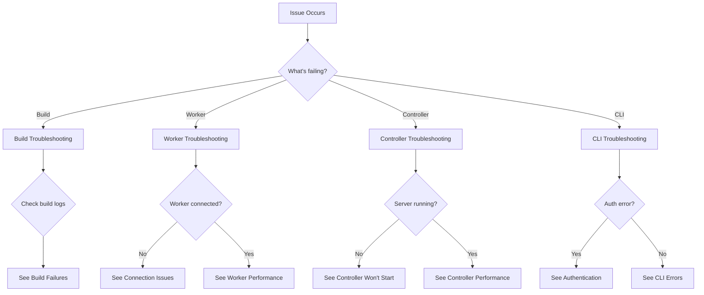

# Troubleshooting Guide

Comprehensive guide to diagnosing and fixing common issues with Expo Free Agent.

## Quick Diagnostic Flowchart



---

## Build Failures

### Build Stuck in "Pending"

**Symptoms:**
- Build shows "pending" for >5 minutes
- No worker assignment

**Diagnosis:**
```bash
# Check controller logs
curl http://controller:3000/health

# Check available workers
curl -H "Authorization: Bearer $API_KEY" \
  http://controller:3000/api/workers
```

**Causes & Solutions:**

| Cause | Solution |
|-------|----------|
| No workers connected | Connect a worker to the controller |
| All workers busy | Wait for worker to become available, or add more workers |
| Worker offline | Restart worker app on Mac |
| Network issue | Check firewall/network connectivity |

**Quick fix:**
```bash
# Force assign to specific worker
expo-build submit --worker worker-001

# Or cancel and retry
expo-build cancel build-abc123
expo-build submit
```

### Build Fails During Dependency Installation

**Symptoms:**
```
npm ERR! code ERESOLVE
npm ERR! ERESOLVE unable to resolve dependency tree
```

**Solutions:**

```bash
# Option 1: Use legacy peer deps
echo "legacy-peer-deps=true" >> .npmrc
git add .npmrc
git commit -m "Fix dependency resolution"
expo-build submit

# Option 2: Update package.json
npm install package-name@compatible-version

# Option 3: Clear npm cache
expo-build submit --clean
```

### Build Fails During Code Signing

**Symptoms:**
```
error: No certificate for team 'ABC123' matching 'Apple Distribution'
```

**Diagnosis:**
```bash
# Verify certificate
security find-identity -v -p codesigning

# Check provisioning profile
security cms -D -i profile.mobileprovision
```

**Solutions:**

```bash
# 1. Export new certificate from Xcode
#    Xcode → Preferences → Accounts → Manage Certificates → Export

# 2. Download new provisioning profile
#    developer.apple.com → Certificates, IDs & Profiles

# 3. Resubmit with new credentials
expo-build submit \
  --cert ./dist-cert.p12 \
  --provision ./profile.mobileprovision
```

### Build Times Out

**Symptoms:**
```
Build exceeded maximum time limit of 30 minutes
Process terminated
```

**Solutions:**

```bash
# Increase timeout
expo-build submit --timeout 60

# Optimize build:
# 1. Exclude unnecessary files
echo "node_modules/" >> .gitignore
echo ".expo/" >> .gitignore
echo "ios/" >> .gitignore

# 2. Use build cache (if available)
expo-build submit --cache

# 3. Pre-install dependencies in VM
# (Requires worker configuration)
```

---

## Worker Issues

### Worker Won't Connect

**Symptoms:**
- Worker shows "Disconnected" in menu bar
- Cannot reach controller

**Diagnosis:**
```bash
# Test controller connectivity
ping controller-ip

# Test controller API
curl http://controller-ip:3000/health

# Check logs
# Worker → View Logs (in menu bar)
```

**Solutions:**

| Issue | Fix |
|-------|-----|
| Wrong URL | Update controller URL in worker settings |
| Wrong API key | Copy API key from controller output |
| Firewall blocking | Allow port 3000 in firewall |
| Controller offline | Start controller: `bun controller` |
| Network issue | Check router/VPN settings |

**Quick fix:**
```bash
# On worker Mac:
# 1. Click menu bar icon
# 2. Settings → Configure
# 3. Controller URL: http://192.168.1.100:3000
# 4. API Key: [paste from controller]
# 5. Click "Save" then "Connect"
```

### Worker Shows "Error: Permission Denied"

**Symptoms:**
```
Error: Operation not permitted
Failed to create VM
```

**Solution:**
```bash
# Grant Full Disk Access
# System Settings → Privacy & Security → Full Disk Access
# Add: /Applications/FreeAgent.app

# Or via command line (requires SIP disabled, not recommended):
# sudo tccutil reset SystemPolicyAllFiles com.expo.freeagent
```

### Worker Consuming Excessive Memory

**Symptoms:**
- Mac becomes slow during builds
- Memory pressure high
- Swap usage increasing

**Diagnosis:**
```bash
# Check memory usage
vm_stat | perl -ne '/page size of (\d+)/ and $size=$1; /Pages\s+([^:]+)[^\d]+(\d+)/ and printf("%-16s % 16.2f MB\n", "$1:", $2 * $size / 1048576);'

# Check active VMs
ps aux | grep -i virtualization
```

**Solutions:**

```bash
# Reduce concurrent builds
# Worker → Settings → Max VMs: 1

# Reduce memory per VM
# Worker → Settings → Memory per VM: 4 GB

# Restart worker
# Worker → Quit → Reopen
```

### Builds Complete But Worker Doesn't Upload

**Symptoms:**
- Build completes in VM
- Artifacts not appearing in controller
- Worker stuck on "Uploading..."

**Diagnosis:**
```bash
# Check worker logs
# Worker → View Logs → Look for upload errors

# Check network
ping controller-ip

# Check disk space on worker
df -h
```

**Solutions:**

```bash
# Retry upload manually
# (Feature coming soon - currently retry by resubmitting build)

# Check controller storage space
ssh user@controller
df -h
# If full, clean old builds

# Increase upload timeout
# Worker → Settings → Upload Timeout: 600
```

---

## Controller Issues

### Controller Won't Start

**Symptoms:**
```
Error: EADDRINUSE: address already in use :::3000
```

**Diagnosis:**
```bash
# Find process using port 3000
lsof -i :3000

# Or
ps aux | grep controller
```

**Solutions:**

```bash
# Option 1: Kill existing process
kill $(lsof -t -i:3000)

# Option 2: Use different port
bun controller -- --port 8080

# Option 3: Restart system
sudo reboot
```

### Controller Database Locked

**Symptoms:**
```
Error: SQLITE_BUSY: database is locked
```

**Solutions:**

```bash
# Stop controller
pkill -f controller

# Check for zombie processes
ps aux | grep sqlite

# Restart controller
bun controller
```

### Controller Out of Disk Space

**Symptoms:**
```
Error: ENOSPC: no space left on device
```

**Diagnosis:**
```bash
# Check disk usage
df -h

# Find large directories
du -sh storage/* | sort -h

# Find old builds
find storage/builds -type d -mtime +30
```

**Solutions:**

```bash
# Clean old builds (>30 days)
find storage/builds -type d -mtime +30 -exec rm -rf {} +

# Or configure auto-cleanup
# (Add to controller config):
{
  "storage": {
    "retentionDays": 30,
    "autoCleanup": true
  }
}
```

### Controller High CPU Usage

**Symptoms:**
- Controller process using >80% CPU
- Slow API responses

**Diagnosis:**
```bash
# Check CPU usage
top -pid $(pgrep -f controller)

# Check active connections
netstat -an | grep 3000 | wc -l
```

**Solutions:**

```bash
# Restart controller
pkill -f controller
bun controller

# Check for stuck workers
curl http://localhost:3000/api/workers

# Reduce worker poll frequency
# Workers → Settings → Poll Interval: 10 seconds
```

---

## CLI Issues

### Authentication Failed

**Symptoms:**
```
Error: 401 Unauthorized
Invalid API key
```

**Solutions:**

```bash
# Verify API key is set
echo $EXPO_CONTROLLER_API_KEY

# Get API key from controller
# Controller output shows: "API Key: xyz..."

# Set API key
export EXPO_CONTROLLER_API_KEY="your-api-key"

# Or create ~/.expo-free-agent config:
cat > ~/.expo-free-agent <<EOF
{
  "controllerUrl": "http://localhost:3000",
  "apiKey": "your-api-key"
}
EOF
```

### Upload Fails: "Request Entity Too Large"

**Symptoms:**
```
Error: 413 Payload Too Large
```

**Solutions:**

```bash
# Reduce project size
echo "node_modules/" >> .gitignore
echo ".expo/" >> .gitignore
echo "ios/" >> .gitignore
echo "android/" >> .gitignore

# Or increase controller limit
# (Requires controller restart)
# Set in controller config:
{
  "upload": {
    "maxSize": "500mb"
  }
}
```

### Download Fails: "File Not Found"

**Symptoms:**
```
Error: 404 Not Found
Artifact does not exist
```

**Diagnosis:**
```bash
# Check build status
expo-build status build-abc123

# List artifacts
expo-build artifacts build-abc123
```

**Solutions:**

```bash
# Wait for build to complete
expo-build wait build-abc123

# Verify build succeeded
expo-build logs build-abc123 | grep -i error

# Check storage on controller
ssh user@controller
ls -la storage/builds/build-abc123/artifacts/
```

---

## Network Issues

### Timeout Connecting to Controller

**Symptoms:**
```
Error: ETIMEDOUT
Could not connect to controller
```

**Diagnosis:**
```bash
# Test connectivity
ping controller-ip

# Test port
telnet controller-ip 3000

# Trace route
traceroute controller-ip
```

**Solutions:**

| Issue | Fix |
|-------|-----|
| Controller offline | Start controller |
| Firewall blocking | Open port 3000 |
| VPN interfering | Disable VPN or add route |
| Wrong IP | Verify controller IP address |
| DNS issue | Use IP instead of hostname |

### SSL Certificate Errors

**Symptoms:**
```
Error: UNABLE_TO_VERIFY_LEAF_SIGNATURE
Self-signed certificate
```

**Solutions:**

```bash
# For development (not recommended for production):
export NODE_TLS_REJECT_UNAUTHORIZED=0

# For production:
# 1. Use proper SSL certificate (Let's Encrypt)
# 2. Configure Nginx with valid cert
# 3. Update CLI to use HTTPS
```

---

## Performance Issues

### Slow Build Times

**Analysis:**
```bash
# Check build logs for time breakdown
expo-build logs build-abc123 | grep "completed in"

# Typical breakdown:
# - Upload: 10-30s
# - Install deps: 3-8 minutes
# - Build: 5-15 minutes
# - Upload artifacts: 30-60s
```

**Optimizations:**

```bash
# 1. Use faster network
# Upload: 50 Mbps+ recommended
# Download: 20 Mbps+ recommended

# 2. Optimize dependencies
npm prune --production

# 3. Use build cache
expo-build submit --cache

# 4. Pre-warm VMs
# (Worker setting, requires configuration)

# 5. Upgrade worker hardware
# Recommended: Mac Mini M2+ with 16 GB RAM
```

### Slow API Responses

**Diagnosis:**
```bash
# Test API latency
time curl http://controller:3000/health

# Should be <100ms
```

**Solutions:**

```bash
# 1. Upgrade controller hardware
# Minimum: 2 GB RAM
# Recommended: 4 GB RAM

# 2. Optimize database
sqlite3 data/controller.db "VACUUM;"
sqlite3 data/controller.db "REINDEX;"

# 3. Add database indices
# (Future: automatic optimization)

# 4. Use SSD storage
# Avoid HDD for controller storage
```

---

## Data Issues

### Build Artifacts Corrupted

**Symptoms:**
- Downloaded IPA won't install
- File size mismatch
- Checksum verification fails

**Diagnosis:**
```bash
# Verify file integrity
expo-build verify build-abc123

# Check file size
ls -lh expo-builds/build-abc123/*.ipa

# Verify code signature
codesign --verify --deep expo-builds/build-abc123/*.ipa
```

**Solutions:**

```bash
# Re-download
rm -rf expo-builds/build-abc123
expo-build download build-abc123

# Verify network stability
# - Use wired connection
# - Avoid VPN during download
# - Check for packet loss: ping -c 100 controller-ip
```

### Database Corruption

**Symptoms:**
```
Error: SQLITE_CORRUPT: database disk image is malformed
```

**Solutions:**

```bash
# Backup current database
cp data/controller.db data/controller.db.backup

# Try to repair
sqlite3 data/controller.db "PRAGMA integrity_check;"

# If corrupted, restore from backup
cp ~/backups/controller-20240128.db data/controller.db

# If no backup, rebuild
# (WARNING: Loses all data)
rm data/controller.db
bun controller  # Will create new database
```

---

## Getting Help

### Before Asking for Help

Collect this information:

```bash
# 1. System information
uname -a  # macOS version
bun --version  # Bun version

# 2. Controller logs
expo-build logs build-abc123 > build-logs.txt

# 3. Worker logs (if applicable)
# Worker → View Logs → Copy to file

# 4. Error messages
# Full error output, not just summary

# 5. Steps to reproduce
# What you did, what you expected, what happened
```

### Support Channels

1. **Documentation** - Check [docs/INDEX.md](../INDEX.md)
2. **GitHub Issues** - [github.com/expo/expo-free-agent/issues](https://github.com/expo/expo-free-agent/issues)
3. **GitHub Discussions** - [github.com/expo/expo-free-agent/discussions](https://github.com/expo/expo-free-agent/discussions)
4. **Discord** - [discord.gg/expo](https://discord.gg/expo) (future)

### Creating Good Bug Reports

Include:

- **Title:** Short, descriptive summary
- **Environment:** OS, versions, hardware
- **Steps to reproduce:** Numbered list
- **Expected behavior:** What should happen
- **Actual behavior:** What actually happened
- **Logs:** Relevant error messages
- **Screenshots:** If UI-related

**Good example:**
```
Title: Build fails with ERESOLVE error on iOS

Environment:
- macOS 14.2.1 (Sonoma)
- Bun 1.0.20
- Controller 0.1.23
- Worker: Mac Mini M2

Steps to reproduce:
1. Create new Expo app with `npx create-expo-app`
2. Add dependency: `npm install react-native-maps`
3. Submit build: `expo-build submit --platform ios`

Expected: Build completes successfully
Actual: Build fails with dependency resolution error

Logs: (attached)

Error message:
npm ERR! ERESOLVE unable to resolve dependency tree
npm ERR! Found: react@18.2.0
npm ERR! peer react@"^17.0.0" from react-native-maps@1.8.0
```

---

## Preventive Measures

### Regular Maintenance

**Weekly:**
```bash
# Check disk space
df -h

# Review failed builds
expo-build list --status failed --since 7d

# Update dependencies
bun update
```

**Monthly:**
```bash
# Backup database
cp data/controller.db ~/backups/controller-$(date +%Y%m%d).db

# Clean old builds
find storage/builds -type d -mtime +30 -exec rm -rf {} +

# Update system packages
sudo apt update && sudo apt upgrade  # Linux
brew upgrade  # macOS
```

**Quarterly:**
```bash
# Review and optimize
# - Worker hardware usage
# - Network bandwidth
# - Storage capacity
# - Build success rate
```

### Monitoring Setup

See [monitoring-setup.md](./monitoring-setup.md) for detailed monitoring configuration.

---

## Advanced Debugging

### Enable Debug Logging

```bash
# Controller
DEBUG=* bun controller

# CLI
expo-build submit --verbose

# Worker
# Settings → Logging → Debug Level
```

### Network Traffic Analysis

```bash
# Capture traffic
sudo tcpdump -i any -w capture.pcap port 3000

# Analyze with Wireshark
wireshark capture.pcap
```

### Database Query Analysis

```bash
# Enable query logging
sqlite3 data/controller.db "PRAGMA query_only = ON;"

# View slow queries
sqlite3 data/controller.db "PRAGMA stats;"
```

---

**Last Updated:** 2026-01-28
