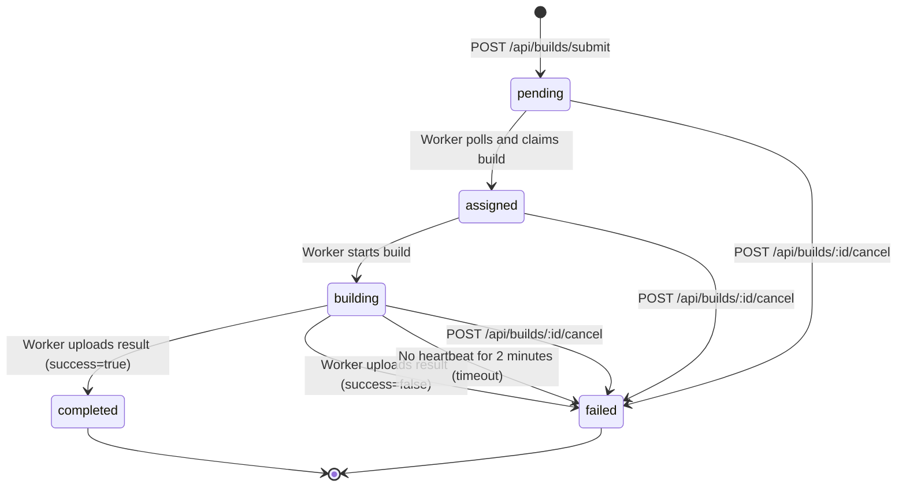

# Expo Free Agent Controller API Reference

**Version:** 1.0.0
**Protocol:** HTTP/REST
**Format:** JSON
**Transport:** Multipart form-data for file uploads

---

## Table of Contents

- [Overview](#overview)
- [Authentication](#authentication)
- [Rate Limiting](#rate-limiting)
- [Error Handling](#error-handling)
- [Build Endpoints](#build-endpoints)
- [Worker Endpoints](#worker-endpoints)
- [System Endpoints](#system-endpoints)

---

## Overview

The Expo Free Agent Controller API enables distributed iOS and Android app builds across a network of macOS workers. This API coordinates build submission, worker management, and result delivery.

### Base URL

```
http://localhost:4000
```

For production deployments, use your controller's hostname/IP.

### Content Types

| Endpoint Type | Request Content-Type | Response Content-Type |
|--------------|---------------------|----------------------|
| Submit/Upload | `multipart/form-data` | `application/json` |
| Query/Status | `application/json` | `application/json` |
| Download | N/A | `application/octet-stream` |

### Timestamps

All timestamps are **Unix milliseconds** (epoch time) unless otherwise noted. Example: `1706450400000` = 2024-01-28 12:00:00 UTC

---

## Authentication

The API supports three authentication methods depending on the endpoint:

### 1. API Key (Admin Access)

**Header:** `X-API-Key`
**Usage:** Full administrative access to all endpoints
**Scope:** Submit builds, view all builds, manage workers, access system stats

```bash
curl -H "X-API-Key: your-api-key-here" \
  https://controller.example.com/api/builds
```

**Security Note:** API keys grant full access. Store securely and rotate regularly. Never commit to git or expose in client-side code.

---

### 2. Build Token (Build Owner Access)

**Header:** `X-Build-Token`
**Usage:** Access specific build only (status, logs, download)
**Scope:** Single build that token was issued for
**Issued:** Returned in response to `POST /api/builds/submit`

```bash
# Submit returns access token
{"id": "abc123", "access_token": "xEj8k..."}

# Use token to check status
curl -H "X-Build-Token: xEj8k..." \
  https://controller.example.com/api/builds/abc123/status
```

**Security Note:** Build tokens enable unprivileged access to build results. Share with CI systems and developers who need build artifacts without full API access.

---

### 3. Worker ID (Worker Access)

**Header:** `X-Worker-Id`
**Usage:** Worker operations (download source, upload results, heartbeats)
**Scope:** Builds assigned to this worker
**Issued:** Returned in response to `POST /api/workers/register`

For sensitive operations (certs-secure endpoint), also requires:

**Header:** `X-Build-Id`
**Purpose:** Prevents build ID tampering in URL

```bash
# Download source for assigned build
curl -H "X-Worker-Id: worker-xyz" \
  https://controller.example.com/api/builds/abc123/source

# Download certs securely (requires both headers)
curl -H "X-Worker-Id: worker-xyz" \
     -H "X-Build-Id: abc123" \
  https://controller.example.com/api/builds/abc123/certs-secure
```

---

## Rate Limiting

**Current Status:** No rate limiting enforced
**Recommended:** Implement rate limiting for production deployments

Suggested limits:
- Build submission: 10 requests/minute per API key
- Status polling: 60 requests/minute per build token
- Worker polling: 1 request/second per worker

---

## Error Handling

### Standard Error Response

All errors return JSON with this structure:

```json
{
  "error": "Human-readable error message"
}
```

For validation errors or detailed failures:

```json
{
  "error": "Build creation failed",
  "reason": "Additional context or technical details"
}
```

### HTTP Status Codes

| Code | Meaning | Common Causes |
|------|---------|---------------|
| `200 OK` | Success | Request completed successfully |
| `201 Created` | Resource created | Build submitted, worker registered |
| `400 Bad Request` | Invalid input | Missing fields, invalid platform, malformed request |
| `401 Unauthorized` | Missing auth | No `X-API-Key`, `X-Build-Token`, or `X-Worker-Id` header |
| `403 Forbidden` | Invalid auth | Wrong API key, expired token, worker not assigned to build |
| `404 Not Found` | Resource missing | Build ID doesn't exist, file not found |
| `413 Payload Too Large` | File too big | Source/certs/result exceeds size limit |
| `422 Unprocessable Entity` | Validation failed | Worker registration validation error |
| `500 Internal Server Error` | Server error | Database failure, storage error, unexpected exception |

### Error Examples

**Missing Authentication:**
```json
HTTP/1.1 401 Unauthorized
{
  "error": "Missing X-API-Key header"
}
```

**Invalid Platform:**
```json
HTTP/1.1 400 Bad Request
{
  "error": "Invalid platform. Must be 'ios' or 'android'"
}
```

**Build Not Found:**
```json
HTTP/1.1 404 Not Found
{
  "error": "Build not found"
}
```

---

## Build Endpoints

### POST /api/builds/submit

Submit a new build to the controller.

**Authentication:** `X-API-Key` (required)

**Request:**

```http
POST /api/builds/submit HTTP/1.1
Content-Type: multipart/form-data
X-API-Key: your-api-key

--boundary
Content-Disposition: form-data; name="platform"

ios
--boundary
Content-Disposition: form-data; name="source"; filename="app.tar.gz"
Content-Type: application/gzip

<binary data>
--boundary
Content-Disposition: form-data; name="certs"; filename="certs.zip"
Content-Type: application/zip

<binary data>
--boundary--
```

**Form Fields:**

| Field | Type | Required | Description |
|-------|------|----------|-------------|
| `platform` | String | ✅ | Build platform: `ios` or `android` |
| `source` | File | ✅ | Source code archive (`.tar.gz` or `.zip`), max 500MB |
| `certs` | File | ❌ | iOS certificates/profiles (`.zip`), max 50MB |

**Response:**

```json
HTTP/1.1 201 Created
{
  "id": "V1bN8xK9rLmQ",
  "status": "pending",
  "platform": "ios",
  "submitted_at": "2024-01-28T12:00:00Z",
  "access_token": "xEj8kP3nR5mT..."
}
```

**Response Fields:**

| Field | Type | Description |
|-------|------|-------------|
| `id` | String | Unique build identifier (nanoid) |
| `status` | String | Build state: `pending`, `assigned`, `building`, `completed`, `failed` |
| `platform` | String | Platform: `ios` or `android` |
| `submitted_at` | String | ISO 8601 timestamp |
| `access_token` | String | Token for accessing this build (save this!) |

**Errors:**

| Status | Error | Cause |
|--------|-------|-------|
| `400` | `Content must be multipart/form-data` | Wrong content type |
| `400` | `Source file required` | Missing `source` field |
| `400` | `Valid platform required (ios\|android)` | Invalid or missing platform |
| `401` | `Missing X-API-Key header` | No authentication |
| `403` | `Invalid API key` | Wrong API key |
| `413` | `Source file too large` | Source exceeds 500MB |
| `413` | `Certs file too large` | Certs exceed 50MB |
| `500` | `Build submission failed` | Server error (check logs) |

**Example:**

```bash
curl -X POST http://localhost:4000/api/builds/submit \
  -H "X-API-Key: dev-key-12345" \
  -F "platform=ios" \
  -F "source=@app.tar.gz" \
  -F "certs=@certs.zip"
```

---

### GET /api/builds

List all builds with optional filters.

**Authentication:** `X-API-Key` (required)

**Query Parameters:**

| Parameter | Type | Description |
|-----------|------|-------------|
| `status` | String | Filter by status: `pending`, `assigned`, `building`, `completed`, `failed` |
| `worker_id` | String | Filter by assigned worker ID |
| `platform` | String | Filter by platform: `ios`, `android` |

**Response:**

```json
{
  "builds": [
    {
      "id": "V1bN8xK9rLmQ",
      "platform": "ios",
      "status": "completed",
      "worker_id": "worker-abc",
      "worker_name": "MacBook Pro (Seth)",
      "submitted_at": "2024-01-28T12:00:00Z",
      "updated_at": "2024-01-28T12:15:00Z",
      "error_message": null,
      "has_result": true
    }
  ],
  "total": 1
}
```

**Example:**

```bash
# All builds
curl -H "X-API-Key: dev-key-12345" \
  http://localhost:4000/api/builds

# Completed iOS builds
curl -H "X-API-Key: dev-key-12345" \
  "http://localhost:4000/api/builds?status=completed&platform=ios"
```

---

### GET /api/builds/active

List currently running builds.

**Authentication:** `X-API-Key` (required)

**Response:**

```json
{
  "builds": [
    {
      "id": "V1bN8xK9rLmQ",
      "status": "building",
      "platform": "ios",
      "worker_id": "worker-abc",
      "started_at": 1706450400000
    }
  ]
}
```

**Example:**

```bash
curl -H "X-API-Key: dev-key-12345" \
  http://localhost:4000/api/builds/active
```

---

### GET /api/builds/:id/status

Get detailed build status.

**Authentication:** `X-API-Key` OR `X-Build-Token` (required)

**Path Parameters:**

| Parameter | Description |
|-----------|-------------|
| `id` | Build ID returned from submit |

**Response:**

```json
{
  "id": "V1bN8xK9rLmQ",
  "status": "building",
  "platform": "ios",
  "worker_id": "worker-abc",
  "submitted_at": 1706450400000,
  "started_at": 1706450460000,
  "completed_at": null,
  "error_message": null
}
```

**Status Values:**

| Status | Description |
|--------|-------------|
| `pending` | Queued, waiting for worker |
| `assigned` | Assigned to worker, not started yet |
| `building` | Worker is building |
| `completed` | Build succeeded, result available |
| `failed` | Build failed, check `error_message` |

**Example:**

```bash
# Using API key (admin)
curl -H "X-API-Key: dev-key-12345" \
  http://localhost:4000/api/builds/V1bN8xK9rLmQ/status

# Using build token (build owner)
curl -H "X-Build-Token: xEj8kP3nR5mT..." \
  http://localhost:4000/api/builds/V1bN8xK9rLmQ/status
```

---

### GET /api/builds/:id/logs

Get build logs.

**Authentication:** `X-API-Key` OR `X-Build-Token` (required)

**Query Parameters:**

| Parameter | Type | Default | Description |
|-----------|------|---------|-------------|
| `limit` | Number | 100 | Maximum log entries to return |

**Response:**

```json
{
  "logs": [
    {
      "level": "info",
      "message": "Build submitted",
      "timestamp": "2024-01-28T12:00:00Z"
    },
    {
      "level": "info",
      "message": "Assigned to worker MacBook Pro (Seth)",
      "timestamp": "2024-01-28T12:01:00Z"
    },
    {
      "level": "info",
      "message": "[VM] Stage: archiving | CPU: 45.2% | Mem: 2048MB",
      "timestamp": "2024-01-28T12:10:00Z"
    }
  ]
}
```

**Log Levels:**

| Level | Description |
|-------|-------------|
| `info` | Normal progress updates |
| `warn` | Non-fatal issues |
| `error` | Build failures, errors |

**Example:**

```bash
# Get last 50 logs
curl -H "X-Build-Token: xEj8kP3nR5mT..." \
  "http://localhost:4000/api/builds/V1bN8xK9rLmQ/logs?limit=50"
```

---

### POST /api/builds/:id/logs

Stream logs from worker (worker-only endpoint).

**Authentication:** `X-Worker-Id` (required, must match assigned worker)

**Request Body (Single Log):**

```json
{
  "level": "info",
  "message": "Xcodebuild started"
}
```

**Request Body (Batch Logs):**

```json
{
  "logs": [
    { "level": "info", "message": "Downloading dependencies" },
    { "level": "info", "message": "Building workspace" }
  ]
}
```

**Response:**

```json
{
  "success": true,
  "count": 2
}
```

**Errors:**

| Status | Error | Cause |
|--------|-------|-------|
| `400` | `Invalid log level. Must be: info, warn, or error` | Invalid level |
| `400` | `Invalid body. Expected { level, message } or { logs: [...] }` | Malformed request |
| `401` | `Missing X-Worker-Id header` | No worker authentication |
| `403` | `Worker not authorized for this build` | Wrong worker |
| `404` | `Build not found` | Invalid build ID |

**Example:**

```bash
# Single log
curl -X POST http://localhost:4000/api/builds/V1bN8xK9rLmQ/logs \
  -H "X-Worker-Id: worker-abc" \
  -H "Content-Type: application/json" \
  -d '{"level": "info", "message": "Build progress: 45%"}'

# Batch logs
curl -X POST http://localhost:4000/api/builds/V1bN8xK9rLmQ/logs \
  -H "X-Worker-Id: worker-abc" \
  -H "Content-Type: application/json" \
  -d '{"logs": [
    {"level": "info", "message": "Step 1 complete"},
    {"level": "info", "message": "Step 2 starting"}
  ]}'
```

---

### GET /api/builds/:id/download

Download build result (`.ipa` or `.apk`).

**Authentication:** `X-API-Key` OR `X-Build-Token` (required)

**Response:**

```http
HTTP/1.1 200 OK
Content-Type: application/octet-stream
Content-Disposition: attachment; filename="V1bN8xK9rLmQ.ipa"

<binary data>
```

**Errors:**

| Status | Error | Cause |
|--------|-------|-------|
| `400` | `Build not completed` | Status is not `completed` |
| `404` | `Build not found` | Invalid build ID |
| `404` | `Build result not found` | Result file missing (internal error) |

**Example:**

```bash
curl -H "X-Build-Token: xEj8kP3nR5mT..." \
  http://localhost:4000/api/builds/V1bN8xK9rLmQ/download \
  -o app.ipa
```

---

### GET /api/builds/:id/source

Download build source (worker-only endpoint).

**Authentication:** `X-Worker-Id` (required, must match assigned worker)

**Response:**

```http
HTTP/1.1 200 OK
Content-Type: application/zip
Content-Disposition: attachment; filename="V1bN8xK9rLmQ.zip"

<binary data>
```

**Example:**

```bash
curl -H "X-Worker-Id: worker-abc" \
  http://localhost:4000/api/builds/V1bN8xK9rLmQ/source \
  -o source.zip
```

---

### GET /api/builds/:id/certs

Download build certificates as ZIP (worker-only endpoint).

**Authentication:** `X-Worker-Id` (required, must match assigned worker)

**Response:**

```http
HTTP/1.1 200 OK
Content-Type: application/zip
Content-Disposition: attachment; filename="V1bN8xK9rLmQ-certs.zip"

<binary data>
```

**Errors:**

| Status | Error | Cause |
|--------|-------|-------|
| `404` | `Certs not found` | Build submitted without certificates |

**Example:**

```bash
curl -H "X-Worker-Id: worker-abc" \
  http://localhost:4000/api/builds/V1bN8xK9rLmQ/certs \
  -o certs.zip
```

---

### GET /api/builds/:id/certs-secure

Get build certificates as JSON for VM bootstrap (worker-only endpoint).

**Authentication:** `X-Worker-Id` AND `X-Build-Id` (both required)

**Purpose:** Enables certificate injection into VM without filesystem operations. Prevents URL tampering via `X-Build-Id` header validation.

**Response:**

```json
{
  "p12": "MIIKZAIBAzCC...",
  "p12Password": "password123",
  "keychainPassword": "rAnD0mP@ssw0rd",
  "provisioningProfiles": [
    "MIIO4AYJKoZIhv...",
    "MIIO4AYJKoZIhv..."
  ]
}
```

**Response Fields:**

| Field | Type | Description |
|-------|------|-------------|
| `p12` | String | Base64-encoded `.p12` certificate |
| `p12Password` | String | Password for `.p12` file (from zip) |
| `keychainPassword` | String | Randomly generated keychain password (24 bytes base64) |
| `provisioningProfiles` | Array | Base64-encoded `.mobileprovision` files |

**Security:**

- Requires both `X-Worker-Id` (worker assigned to build) AND `X-Build-Id` (matches URL)
- Prevents workers from accessing other builds' certificates
- Keychain password is random per request for VM isolation

**Example:**

```bash
curl -H "X-Worker-Id: worker-abc" \
     -H "X-Build-Id: V1bN8xK9rLmQ" \
  http://localhost:4000/api/builds/V1bN8xK9rLmQ/certs-secure
```

---

### POST /api/builds/:id/heartbeat

Worker sends heartbeat to prove build is still alive.

**Authentication:** Via query parameter `worker_id` (legacy, prefer header in future)

**Query Parameters:**

| Parameter | Type | Required | Description |
|-----------|------|----------|-------------|
| `worker_id` | String | ✅ | Worker ID performing the build |

**Request Body:**

```json
{
  "progress": 45
}
```

**Response:**

```json
{
  "status": "ok",
  "timestamp": 1706450460000
}
```

**Purpose:** Prevents build timeout failures. Controller marks builds as failed if no heartbeat received within 2 minutes.

**Example:**

```bash
curl -X POST "http://localhost:4000/api/builds/V1bN8xK9rLmQ/heartbeat?worker_id=worker-abc" \
  -H "Content-Type: application/json" \
  -d '{"progress": 67}'
```

---

### POST /api/builds/:id/telemetry

Receive detailed VM telemetry (CPU, memory, build stage).

**Authentication:** `X-Worker-Id` AND `X-Build-Id` (both required)

**Request Body:**

```json
{
  "type": "heartbeat",
  "timestamp": "2024-01-28T12:05:00Z",
  "data": {
    "stage": "building",
    "metrics": {
      "cpu_percent": 78.5,
      "memory_mb": 2048,
      "disk_percent": 15
    },
    "heartbeat_count": 12
  }
}
```

**Telemetry Types:**

| Type | Description | Data Fields |
|------|-------------|-------------|
| `monitor_started` | VM monitor initialized | None |
| `heartbeat` | Regular progress update | `stage`, `metrics`, `heartbeat_count` |
| `cpu_snapshot` | CPU/memory snapshot | `cpu_percent`, `memory_mb` |

**CPU Snapshots:**

For `type: "cpu_snapshot"`, controller stores CPU/memory metrics in database for performance analysis.

**Validation:**

| Field | Min | Max | Description |
|-------|-----|-----|-------------|
| `cpu_percent` | 0 | 1000 | CPU usage percentage (multi-core systems may exceed 100%) |
| `memory_mb` | 0 | 1,000,000 | Memory usage in megabytes |

**Example:**

```bash
curl -X POST http://localhost:4000/api/builds/V1bN8xK9rLmQ/telemetry \
  -H "X-Worker-Id: worker-abc" \
  -H "X-Build-Id: V1bN8xK9rLmQ" \
  -H "Content-Type: application/json" \
  -d '{
    "type": "cpu_snapshot",
    "timestamp": "2024-01-28T12:05:00Z",
    "data": {
      "cpu_percent": 85.2,
      "memory_mb": 3072
    }
  }'
```

---

### POST /api/builds/:id/cancel

Cancel a pending or running build.

**Authentication:** `X-API-Key` (required)

**Response:**

```json
{
  "status": "cancelled"
}
```

**Errors:**

| Status | Error | Cause |
|--------|-------|-------|
| `400` | `Build already finished` | Build is `completed` or `failed` |
| `404` | `Build not found` | Invalid build ID |

**Side Effects:**

- Build marked as `failed` with error: "Build cancelled by user"
- Assigned worker (if any) marked as `idle`
- Build removed from queue

**Example:**

```bash
curl -X POST http://localhost:4000/api/builds/V1bN8xK9rLmQ/cancel \
  -H "X-API-Key: dev-key-12345"
```

---

### POST /api/builds/:id/retry

Retry a failed or completed build with same source/settings.

**Authentication:** `X-API-Key` OR `X-Build-Token` (required)

**Response:**

```json
{
  "id": "nEw8uIk3rQpM",
  "status": "pending",
  "submitted_at": 1706450500000,
  "access_token": "yFk9lQ4oS6nU...",
  "original_build_id": "V1bN8xK9rLmQ"
}
```

**Behavior:**

- Copies source and certificates from original build
- Creates new build with new ID and access token
- Adds to build queue
- Logs retry in both original and new build

**Errors:**

| Status | Error | Cause |
|--------|-------|-------|
| `400` | `Original build source no longer available. Please submit a new build.` | Source files deleted or missing |
| `404` | `Build not found` | Invalid original build ID |

**Example:**

```bash
curl -X POST http://localhost:4000/api/builds/V1bN8xK9rLmQ/retry \
  -H "X-Build-Token: xEj8kP3nR5mT..."
```

---

## Worker Endpoints

### POST /api/workers/register

Register a new worker with the controller.

**Authentication:** `X-API-Key` (required)

**Request Body:**

```json
{
  "id": "worker-unique-id",
  "name": "MacBook Pro (Seth)",
  "capabilities": {
    "platform": "darwin",
    "arch": "arm64",
    "xcode_version": "15.2",
    "max_concurrent_builds": 1
  }
}
```

**Response:**

```json
{
  "id": "worker-unique-id",
  "status": "registered",
  "message": "Worker registered successfully"
}
```

**Errors:**

| Status | Error | Cause |
|--------|-------|-------|
| `422` | `Registration failed` | Validation error (see `details`) |

**Example:**

```bash
curl -X POST http://localhost:4000/api/workers/register \
  -H "X-API-Key: dev-key-12345" \
  -H "Content-Type: application/json" \
  -d '{
    "id": "worker-mbp-2023",
    "name": "MacBook Pro M1 Max",
    "capabilities": {
      "platform": "darwin",
      "arch": "arm64"
    }
  }'
```

---

### GET /api/workers/poll

Worker polls for next available build job.

**Authentication:** `X-API-Key` (required)

**Query Parameters:**

| Parameter | Type | Required | Description |
|-----------|------|----------|-------------|
| `worker_id` | String | ✅ | Worker ID from registration |

**Response (Job Available):**

```json
{
  "job": {
    "id": "V1bN8xK9rLmQ",
    "platform": "ios",
    "source_url": "/api/builds/V1bN8xK9rLmQ/source",
    "certs_url": "/api/builds/V1bN8xK9rLmQ/certs",
    "submitted_at": "2024-01-28T12:00:00Z"
  }
}
```

**Response (No Jobs):**

```json
{
  "job": null
}
```

**Behavior:**

- Updates worker `last_seen_at` timestamp (heartbeat)
- Atomically assigns next pending build to worker
- Returns existing job if worker already has active build

**Polling Frequency:** Recommended 1 request per second max

**Example:**

```bash
curl -H "X-API-Key: dev-key-12345" \
  "http://localhost:4000/api/workers/poll?worker_id=worker-abc"
```

---

### POST /api/workers/upload

Worker uploads build result after completion.

**Authentication:** `X-API-Key` (required)

**Request:**

```http
POST /api/workers/upload HTTP/1.1
Content-Type: multipart/form-data
X-API-Key: dev-key-12345

--boundary
Content-Disposition: form-data; name="build_id"

V1bN8xK9rLmQ
--boundary
Content-Disposition: form-data; name="worker_id"

worker-abc
--boundary
Content-Disposition: form-data; name="success"

true
--boundary
Content-Disposition: form-data; name="result"; filename="app.ipa"
Content-Type: application/octet-stream

<binary data>
--boundary--
```

**Form Fields:**

| Field | Type | Required | Description |
|-------|------|----------|-------------|
| `build_id` | String | ✅ | Build ID from poll response |
| `worker_id` | String | ✅ | Worker ID |
| `success` | String | ✅ | `"true"` or `"false"` |
| `result` | File | If success=true | Build artifact (`.ipa` or `.apk`), max 2GB |
| `error_message` | String | If success=false | Error description |

**Response (Success):**

```json
{
  "status": "success"
}
```

**Response (Failure):**

```json
{
  "status": "failed"
}
```

**Side Effects:**

- Build marked as `completed` or `failed`
- Worker marked as `idle`
- Build removed from queue
- Worker build count incremented

**Example (Success):**

```bash
curl -X POST http://localhost:4000/api/workers/upload \
  -H "X-API-Key: dev-key-12345" \
  -F "build_id=V1bN8xK9rLmQ" \
  -F "worker_id=worker-abc" \
  -F "success=true" \
  -F "result=@app.ipa"
```

**Example (Failure):**

```bash
curl -X POST http://localhost:4000/api/workers/upload \
  -H "X-API-Key: dev-key-12345" \
  -F "build_id=V1bN8xK9rLmQ" \
  -F "worker_id=worker-abc" \
  -F "success=false" \
  -F "error_message=Xcode build failed: Code signing error"
```

---

### GET /api/workers/:id/stats

Get worker statistics and uptime.

**Authentication:** `X-API-Key` (required)

**Response:**

```json
{
  "totalBuilds": 47,
  "successfulBuilds": 42,
  "failedBuilds": 5,
  "workerName": "MacBook Pro (Seth)",
  "status": "idle",
  "uptime": "3d 14h"
}
```

**Uptime Format:**

| Range | Format | Example |
|-------|--------|---------|
| < 1 minute | Seconds | `45s` |
| < 1 hour | Minutes + seconds | `23m 45s` |
| < 1 day | Hours + minutes | `5h 23m` |
| ≥ 1 day | Days + hours | `3d 14h` |

**Example:**

```bash
curl -H "X-API-Key: dev-key-12345" \
  http://localhost:4000/api/workers/worker-abc/stats
```

---

## System Endpoints

### GET /health

Health check endpoint for load balancers and monitoring.

**Authentication:** None (public)

**Response:**

```json
{
  "status": "ok",
  "queue": {
    "pending": 3,
    "active": 2
  },
  "storage": {
    "totalBytes": 1073741824,
    "freeBytes": 536870912
  }
}
```

**Usage:**

- Load balancer health checks
- Monitoring system heartbeats
- Deployment readiness checks

**Example:**

```bash
curl http://localhost:4000/health
```

---

### GET /api/stats

Get real-time network statistics (public endpoint for landing page).

**Authentication:** None (public)

**Response:**

```json
{
  "nodesOnline": 127,
  "buildsQueued": 83,
  "activeBuilds": 24,
  "buildsToday": 8492,
  "totalBuilds": 80123456,
  "totalBuildTimeMs": 24037036800000,
  "totalCpuCycles": 9614814720
}
```

**Caching:** Results cached for 10 seconds

**Example:**

```bash
curl http://localhost:4000/api/stats
```

---

## Appendix: Build Lifecycle



**State Descriptions:**

- **pending**: Queued, waiting for worker to claim
- **assigned**: Worker claimed but hasn't started building yet
- **building**: Worker actively building
- **completed**: Build succeeded, artifact ready for download
- **failed**: Build failed or cancelled, see logs for details

---

## Appendix: Authentication Matrix

| Endpoint | Admin (API Key) | Build Owner (Token) | Worker (Worker ID) | Public |
|----------|:---------------:|:-------------------:|:------------------:|:------:|
| `POST /api/builds/submit` | ✅ | ❌ | ❌ | ❌ |
| `GET /api/builds` | ✅ | ❌ | ❌ | ❌ |
| `GET /api/builds/active` | ✅ | ❌ | ❌ | ❌ |
| `GET /api/builds/:id/status` | ✅ | ✅ | ❌ | ❌ |
| `GET /api/builds/:id/logs` | ✅ | ✅ | ❌ | ❌ |
| `POST /api/builds/:id/logs` | ❌ | ❌ | ✅ | ❌ |
| `GET /api/builds/:id/download` | ✅ | ✅ | ❌ | ❌ |
| `GET /api/builds/:id/source` | ❌ | ❌ | ✅ | ❌ |
| `GET /api/builds/:id/certs` | ❌ | ❌ | ✅ | ❌ |
| `GET /api/builds/:id/certs-secure` | ❌ | ❌ | ✅ + Build ID | ❌ |
| `POST /api/builds/:id/heartbeat` | ❌ | ❌ | ✅ | ❌ |
| `POST /api/builds/:id/telemetry` | ❌ | ❌ | ✅ + Build ID | ❌ |
| `POST /api/builds/:id/cancel` | ✅ | ❌ | ❌ | ❌ |
| `POST /api/builds/:id/retry` | ✅ | ✅ | ❌ | ❌ |
| `POST /api/workers/register` | ✅ | ❌ | ❌ | ❌ |
| `GET /api/workers/poll` | ✅ | ❌ | ❌ | ❌ |
| `POST /api/workers/upload` | ✅ | ❌ | ❌ | ❌ |
| `GET /api/workers/:id/stats` | ✅ | ❌ | ❌ | ❌ |
| `GET /health` | ❌ | ❌ | ❌ | ✅ |
| `GET /api/stats` | ❌ | ❌ | ❌ | ✅ |

---

## Support

For issues, questions, or contributions:

- **Repository:** [Expo Free Agent on GitHub](https://github.com/expo/expo-free-agent)
- **Documentation:** See `docs/INDEX.md` for architecture and deployment guides
- **Issues:** File bug reports and feature requests on GitHub

---

*This API reference is version-controlled alongside the codebase. Last updated: 2024-01-28*
